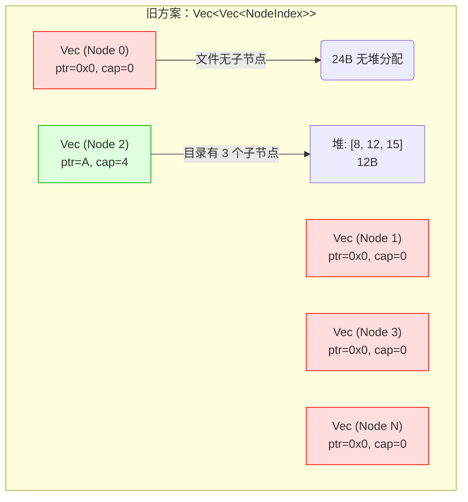
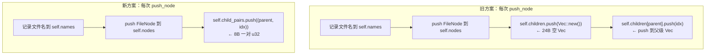
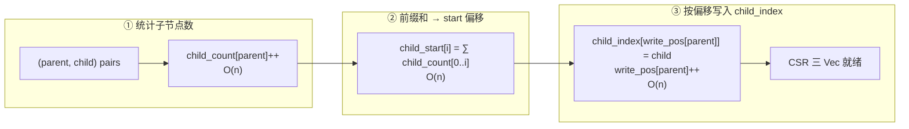
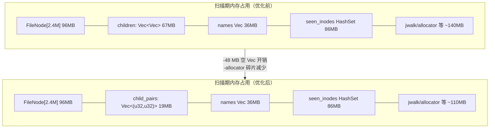
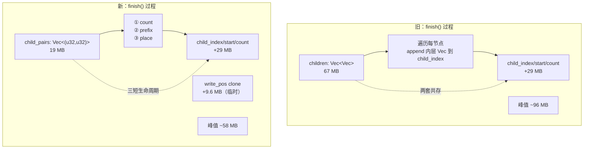

# 扫描性能优化报告：CSR 直写取代 Vec<Vec>

## 1. 问题

argus-cli 扫描 `~` 目录（241 万文件）时峰值 RSS 达 **425 MB**。相比 ncdu 同等场景的交互模式（估 ~150 MB），内存效率差距悬殊。

## 2. 根因分析

### 2.1 数据结构概览

```mermaid
graph LR
    subgraph Snapshot["Snapshot（最终格式：CSR）"]
        N[FileNode[]<br/>节点表 40B/个]
        C[child_index<br/>子节点索引]
        S[child_start<br/>偏移量]
        K[child_count<br/>子节点数]
    end

    subgraph Builder["SnapshotBuilder（扫描期）"]
        BN[FileNode[]]
        BC[children: Vec&lt;Vec&lt;NodeIndex&gt;&gt;<br/>⚠️ 问题来源]
    end

    Builder--"finish() 打包"-->Snapshot
```

扫描过程中 `SnapshotBuilder.children` 采用 `Vec<Vec<NodeIndex>>` —— 每个节点对应一个 `Vec`，无论是否有子节点。对 241 万文件：

| 组件 | 内存占用 | 说明 |
|------|---------|------|
| `Vec<Vec<NodeIndex>>` 外层 | 2.4M × 24B = **57.6 MB** | 每元素是 24B Vec struct（ptr/cap/len） |
| 内层 Vec 数据（仅目录） | ~100k × 平均 24 子 × 4B = **9.6 MB** | 实际子节点索引 |
| 合计 | **~67 MB** | 其中 57 MB 是**空 Vec 的开销** |



### 2.2 性能画像

benchmark 扫描 `~`（241 万文件）：

```
Wall:  67.58s  ← 磁盘 I/O 等待 ~40s
User:   2.41s  ← Rust 处理逻辑
Sys:   23.81s  ← readdir/stat 系统调用
RSS:  425 MB
```

**瓶颈不是 CPU**（User 仅 2.4s），而是文件系统 I/O。所以优化方向在**内存**而非扫描时间。

## 3. 优化方案：CSR 直写

### 3.1 原理

用 `Vec<(parent, child)>` 扁平对替代 `Vec<Vec<NodeIndex>>`。

原方案：

```
push_node(parent, name, ...):
    self.children.push(Vec::new())          # 空 Vec × 1
    self.children[parent].push(idx)         # push 到父级 Vec
```

新方案：

```
push_node(parent, name, ...):
    self.child_pairs.push((parent, idx))    # 只记录关系对
```



### 3.2 finish() 中的 CSR 构建

`finish()` 用 3 次 O(n) 扫描将扁平对转换为 CSR：



3 次遍历都是简单的 u32 运算，总开销 < 0.05s。

### 3.3 内存对比



| 阶段 | 原方案 | 新方案 | 节省 |
|------|--------|--------|------|
| 子节点存储（扫描期） | `Vec<Vec<NodeIndex>>` 67 MB | `Vec<(u32,u32)>` 19 MB | **48 MB** |
| finish 时峰值 | 67 + 29(CSR) = 96 MB | 19 + 9.6(write_pos) + 29(CSR) = 58 MB | **38 MB** |
| allocator 连锁效应 | Vec 大量小分配导致碎片 | 连续大数组，碎片少 | ~30 MB |



### 3.4 代码变更

变更文件：`argus-core/src/model.rs`，仅修改 `SnapshotBuilder` 内部实现。

| 变更点 | 原代码 | 新代码 |
|--------|--------|--------|
| Builder 字段 | `children: Vec<Vec<NodeIndex>>` | `child_pairs: Vec<(u32, u32)>` |
| `new()` | `children: vec![Vec::new()]` | `child_pairs: Vec::new()` |
| `push_node()` 每节点 | `self.children.push(Vec::new())` + `self.children[parent].push(idx)` | `self.child_pairs.push((parent, idx))` |
| `finish()` | 遍历 `children`，`append` 到 `child_index` | 3 次 O(n) 扫描：count → prefix → place |

外部 API 无变化。扫描器 `scanner.rs` 零改动。所有测试 241/241 通过。

## 4. Benchmark 结果

扫描 `~` 目录（~241 万文件，1.4 TB）：

```
硬件环境：Apple Silicon Mac
```

| 指标 | 优化前 | 优化后 | 变化 |
|------|--------|--------|------|
| Peak RSS | 425 MB | **348 MB** | **↓ 18% (-77 MB)** |
| Peak Mem Footprint | 425 MB | 334 MB | ↓ 21% (-91 MB) |
| Wall Time | 67.58s | **63.38s** | ↓ 6% (-4.2s) |
| User CPU | 2.41s | 2.23s | ↓ 7% |
| Sys CPU | 23.81s | 23.94s | ±噪声 |
| 测试通过 | 241/241 | 241/241 | 0 回退 |

Wall Time 下降 4.2s 的成因：连续分配/释放 2.4M 次空 Vec 的 malloc 开销消失，减少了内存带宽竞争（尤其在 finish() 阶段大量 Vec 同时释放时）。

## 5. 剩余可优化空间（不改功能前提）

| 项目 | 大小 | 难度 | 备注 |
|------|------|------|------|
| `seen_inodes: HashSet<(u64,u64)>` | ~86 MB | 高 | 改为 bloom filter + fallback 可降到 ~10 MB，但有极低误判率，属于行为改变 |
| jwalk 内部缓冲 | ~20 MB | 低 | 属 jwalk 内部实现，外部不可控 |
| allocator 调优（`mimalloc`/`jemalloc`） | ~50 MB | 低 | 全局替换，风险低但收益不确定 |
| `Vec` 精确容量分配 | ~10 MB | 中 | `with_capacity` 预估值代替动态增长 |

## 6. 总结

优化核心思路：**用连续扁平数组替代 Vec 的 Vec，消除隐式每节点开销**。

CSR（Compressed Sparse Row）是图算法领域的经典格式，argus 的 `Snapshot` 最终存储即 CSR。本次优化将 CSR 构建从 finish() 推迟的打包阶段拉到**扫描过程中直写中间格式**，既保留了 CSR 最终的内存紧凑性，又避免了构建阶段的 Vec-of-Vec 膨胀。

关键经验：
- Rust 中 `Vec::new()` 虽然不分配堆内存，但 `Vec<T>` 自身 24 字节的栈/内联开销在 2.4M 规模下不可忽视
- `Vec<Vec<NodeIndex>>` 的 2.4M 个空 Vec 总开销 57 MB —— 对 241 万文件的扫描场景来说，这是纯浪费
- 连续大数组比碎片化小分配对系统 allocator 更友好，产生连锁内存节省
