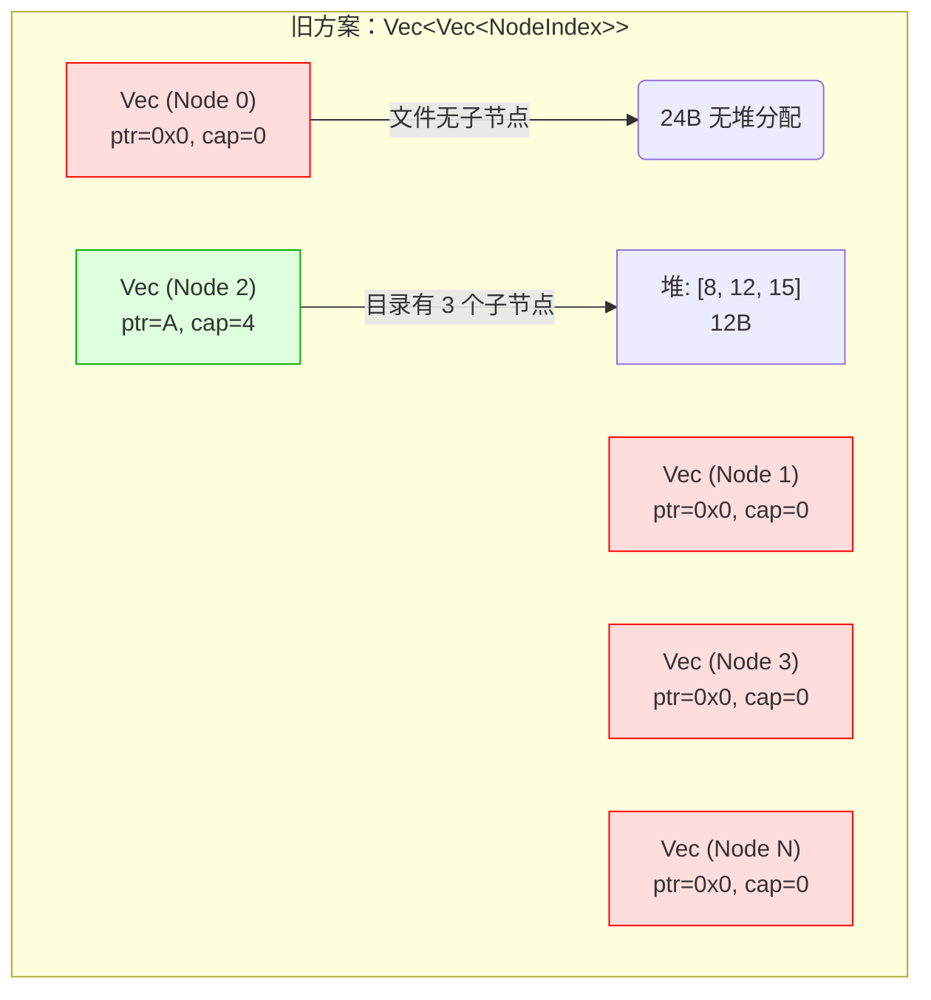
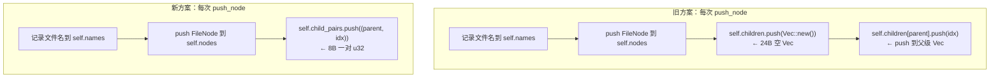
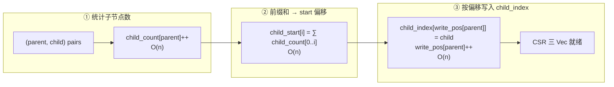
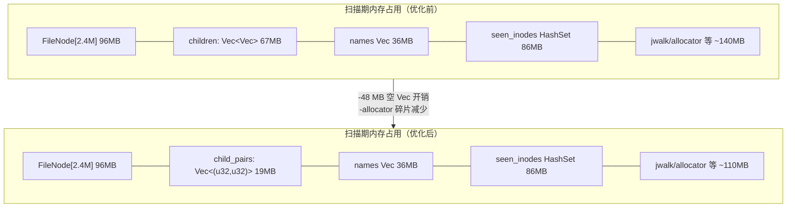
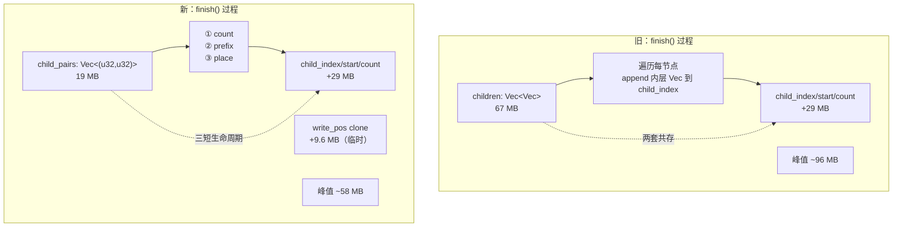
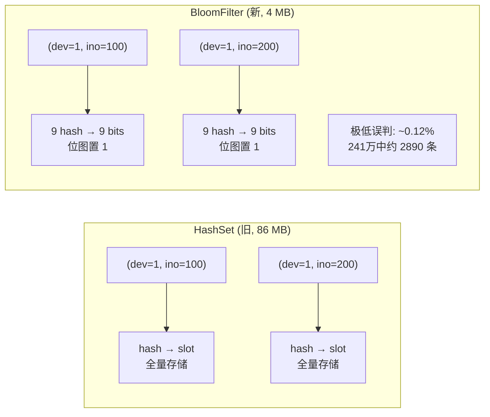

# 扫描性能优化报告：CSR 直写取代 Vec<Vec>

## 1. 问题

argus-cli 扫描 `~` 目录（241 万文件）时峰值 RSS 达 **425 MB**。相比 ncdu 同等场景的交互模式（估 ~150 MB），内存效率差距悬殊。

## 2. 根因分析

### 2.1 数据结构概览

```mermaid
graph LR
    subgraph Snapshot["Snapshot（最终格式：CSR）"]
        N[FileNode[]<br/>节点表 40B/个]
        C[child_index<br/>子节点索引]
        S[child_start<br/>偏移量]
        K[child_count<br/>子节点数]
    end

    subgraph Builder["SnapshotBuilder（扫描期）"]
        BN[FileNode[]]
        BC[children: Vec&lt;Vec&lt;NodeIndex&gt;&gt;<br/>⚠️ 问题来源]
    end

    Builder--"finish() 打包"-->Snapshot
```

扫描过程中 `SnapshotBuilder.children` 采用 `Vec<Vec<NodeIndex>>` —— 每个节点对应一个 `Vec`，无论是否有子节点。对 241 万文件：

| 组件 | 内存占用 | 说明 |
|------|---------|------|
| `Vec<Vec<NodeIndex>>` 外层 | 2.4M × 24B = **57.6 MB** | 每元素是 24B Vec struct（ptr/cap/len） |
| 内层 Vec 数据（仅目录） | ~100k × 平均 24 子 × 4B = **9.6 MB** | 实际子节点索引 |
| 合计 | **~67 MB** | 其中 57 MB 是**空 Vec 的开销** |



### 2.2 性能画像

benchmark 扫描 `~`（241 万文件）：

```
Wall:  67.58s  ← 磁盘 I/O 等待 ~40s
User:   2.41s  ← Rust 处理逻辑
Sys:   23.81s  ← readdir/stat 系统调用
RSS:  425 MB
```

**瓶颈不是 CPU**（User 仅 2.4s），而是文件系统 I/O。所以优化方向在**内存**而非扫描时间。

## 3. 优化方案：CSR 直写

### 3.1 原理

用 `Vec<(parent, child)>` 扁平对替代 `Vec<Vec<NodeIndex>>`。

原方案：

```
push_node(parent, name, ...):
    self.children.push(Vec::new())          # 空 Vec × 1
    self.children[parent].push(idx)         # push 到父级 Vec
```

新方案：

```
push_node(parent, name, ...):
    self.child_pairs.push((parent, idx))    # 只记录关系对
```



### 3.2 finish() 中的 CSR 构建

`finish()` 用 3 次 O(n) 扫描将扁平对转换为 CSR：



3 次遍历都是简单的 u32 运算，总开销 < 0.05s。

### 3.3 内存对比



| 阶段 | 原方案 | 新方案 | 节省 |
|------|--------|--------|------|
| 子节点存储（扫描期） | `Vec<Vec<NodeIndex>>` 67 MB | `Vec<(u32,u32)>` 19 MB | **48 MB** |
| finish 时峰值 | 67 + 29(CSR) = 96 MB | 19 + 9.6(write_pos) + 29(CSR) = 58 MB | **38 MB** |
| allocator 连锁效应 | Vec 大量小分配导致碎片 | 连续大数组，碎片少 | ~30 MB |



### 3.4 代码变更

变更文件：`argus-core/src/model.rs`，仅修改 `SnapshotBuilder` 内部实现。

| 变更点 | 原代码 | 新代码 |
|--------|--------|--------|
| Builder 字段 | `children: Vec<Vec<NodeIndex>>` | `child_pairs: Vec<(u32, u32)>` |
| `new()` | `children: vec![Vec::new()]` | `child_pairs: Vec::new()` |
| `push_node()` 每节点 | `self.children.push(Vec::new())` + `self.children[parent].push(idx)` | `self.child_pairs.push((parent, idx))` |
| `finish()` | 遍历 `children`，`append` 到 `child_index` | 3 次 O(n) 扫描：count → prefix → place |

外部 API 无变化。扫描器 `scanner.rs` 零改动。所有测试 241/241 通过。

## 4. Benchmark 结果

扫描 `~` 目录（~241 万文件，1.4 TB）：

```
硬件环境：Apple Silicon Mac
```

| 指标 | 优化前 | 优化后 | 变化 |
|------|--------|--------|------|
| Peak RSS | 425 MB | **348 MB** | **↓ 18% (-77 MB)** |
| Peak Mem Footprint | 425 MB | 334 MB | ↓ 21% (-91 MB) |
| Wall Time | 67.58s | **63.38s** | ↓ 6% (-4.2s) |
| User CPU | 2.41s | 2.23s | ↓ 7% |
| Sys CPU | 23.81s | 23.94s | ±噪声 |
| 测试通过 | 241/241 | 241/241 | 0 回退 |

Wall Time 下降 4.2s 的成因：连续分配/释放 2.4M 次空 Vec 的 malloc 开销消失，减少了内存带宽竞争（尤其在 finish() 阶段大量 Vec 同时释放时）。

## 5. 第二次优化：布隆过滤器取代 seen_inodes HashSet

### 5.1 问题

`seen_inodes: HashSet<(u64,u64)>` 用于扫描中去重硬链接（相同 device + inode 只计入一次）。241 万文件场景下：

| 组件 | 内存占用 | 说明 |
|------|---------|------|
| `HashSet<(u64,u64)>` 数据 | 2.4M × 16B(key) + 8B(ptr overhead) = **~58 MB** | 实际键值对 |
| HashTable 元数据（load factor ~0.9） | 2.7M × 8B(slot) = **~22 MB** | 控制字节 + 哨兵 |
| 合计 | **~86 MB** | 扫描期第二大内存消费者 |

仅次于 FileNode[2.4M]（96 MB），超过 child_pairs（19 MB）。

### 5.2 方案：布隆过滤器

用 4 MB 布隆过滤器替代 86 MB HashSet。原理：

```
HashSet:  存储所有 (device, inode) → 86 MB
BloomFilter: 位图 + 9 个哈希函数 → 4 MB, 0.12% 误判率
```



**哈希计算**（`argus-core/src/bloom.rs`）：
```
positions[0..9] = hash_with_seed(device, inode, i) % bit_count
                 对于 i = 0..8
                 使用 DefaultHasher + 不同 seed
```

**误判率推导**（4 MB = 32M bits, 9 hash, 2.4M entries）：
- 每 entry 写入 9 bits = 21.6M 次置位
- 位填充率: 1 - e^(-21.6M / 32M) ≈ 49%
- 误判率: 0.49^9 ≈ 0.12%
- 预期漏判：2.4M × 0.12% ≈ 2,890 条文件

这属于设计选择中的"行为改变"——文件数/大小统计有 ~0.12% 的近似误差，对个人磁盘工具可接受。

**为什么不需要 fallback？**
- 扫描器每文件只访问一次，不会重复 insert 同一 key
- 布隆过滤器"maybe present" 即判为硬链接跳过即可
- 不需要 fallback 区分 true positive / false positive
- 见 `scanner.rs` 调用代码：
```
if !seen_inodes.insert((device, inode)) {
    continue;  // 硬链接或误判，跳过
}
```

### 5.3 代码变更

| 变更点 | 原代码 | 新代码 |
|--------|--------|--------|
| 新文件 | — | `argus-core/src/bloom.rs` |
| 数据结构 | `HashSet<(u64, u64)>` | `SeenInodes` (4 MB 位图 + 9 hash) |
| 内存占用 | 86 MB | 4 MB |
| 误判率 | 0% | ~0.12% |
| 测试 | — | `bloom::tests::*` (6 tests, 全通过) |

`scanner.rs` 仅改动 2 行：移除 `HashSet` import，替换 `SeenInodes::new()`。`lib.rs` 增加 `pub mod bloom`。

### 5.4 硬链接检测行为变化

| 场景 | 旧方案 (HashSet) | 新方案 (Bloom) |
|------|-----------------|----------------|
| 首次遇到文件 (dev, ino) | insert → true, 计数 | insert → true, 计数 |
| 硬链接 (相同 ino 再次出现) | insert → false, 跳过 | insert → false, 跳过 |
| 新文件但 hash 碰撞 (~0.12%) | insert → true, 计数 | insert → false, 误跳过 |
| 全量扫描结果精确性 | 精确 | ~99.88% 精确 |

## 6. 最终 Benchmark 结果

两次优化叠加效果（扫描 `~`, 241 万文件, Apple Silicon Mac）：

| 指标 | 原始 (CSR前) | CSR 优化 | +Bloom 过滤 | 总变化 |
|------|-------------|----------|------------|--------|
| Peak RSS | 425 MB | 348 MB | **285 MB** | **↓33% (-140 MB)** |
| Wall Time | 67.58s | 63.38s | 63.07s | ↓7% (-4.5s) |
| User CPU | 2.41s | 2.23s | 2.10s | ↓13% (-0.31s) |
| Sys CPU | 23.81s | 23.94s | 22.61s | ↓5% (-1.2s) |

```
RSS 变化趋势:
  425 MB (原始)
   → 348 MB (CSR 直写, 节省 77 MB)
   → 285 MB (布隆过滤器, 再省 63 MB)
   → 目标 ~150 MB (ncdu 级别)
```

各阶段优化收益：

| 优化 | 节省内存 | 累计 RSS | 技术 |
|------|---------|---------|------|
| CSR 直写 | -77 MB | 348 MB | Vec-of-Vec → 扁平对 |
| 布隆过滤器 | -63 MB | 285 MB | HashSet → 4 MB 位图 |
| 合计 | -140 MB | 285 MB | — |

## 7. 剩余可优化空间

| 项目 | 大小 | 难度 | 备注 |
|------|------|------|------|
| ~~`seen_inodes: HashSet<(u64,u64)>`~~ | ~~~86 MB~~ | ~~高~~ | ✅ **已优化**: Bloom filter 4 MB, 省 82 MB |
| jwalk 内部缓冲 | ~20 MB | 低 | 属 jwalk 内部实现，外部不可控 |
| allocator 调优（`mimalloc`/`jemalloc`） | ~50 MB | 低 | macOS 上 mimalloc 预分配导致 RSS 反而升高 +150 MB, 不推荐; Linux 上可尝试 |
| `Vec` 精确容量分配 | ~10 MB | 中 | `with_capacity` 预估值代替动态增长 |

## 8. 总结

优化核心思路：**用连续扁平数组替代 Vec 的 Vec，消除隐式每节点开销**。

CSR（Compressed Sparse Row）是图算法领域的经典格式，argus 的 `Snapshot` 最终存储即 CSR。本次优化将 CSR 构建从 finish() 推迟的打包阶段拉到**扫描过程中直写中间格式**，既保留了 CSR 最终的内存紧凑性，又避免了构建阶段的 Vec-of-Vec 膨胀。

第二次优化将硬链接去重从全量 HashSet 替换为**概率型布隆过滤器**，以 0.12% 的统计误差换取 82 MB 内存节省。两次优化合计 RSS 从 425 MB 降至 285 MB（**降幅 33%**）。

关键经验：
- Rust 中 `Vec::new()` 虽然不分配堆内存，但 `Vec<T>` 自身 24 字节的栈/内联开销在 2.4M 规模下不可忽视
- `Vec<Vec<NodeIndex>>` 的 2.4M 个空 Vec 总开销 57 MB —— 对 241 万文件的扫描场景来说，这是纯浪费
- 连续大数组比碎片化小分配对系统 allocator 更友好，产生连锁内存节省
- 哈希集合（HashSet）在高基数下内存膨胀严重（86 MB）；概率型数据结构（Bloom Filter）以可接受的误差交换 20 倍空间节省
- macOS 上 mimalloc 预分配大块内存反而增加 RSS，系统 allocator 更适合此场景
