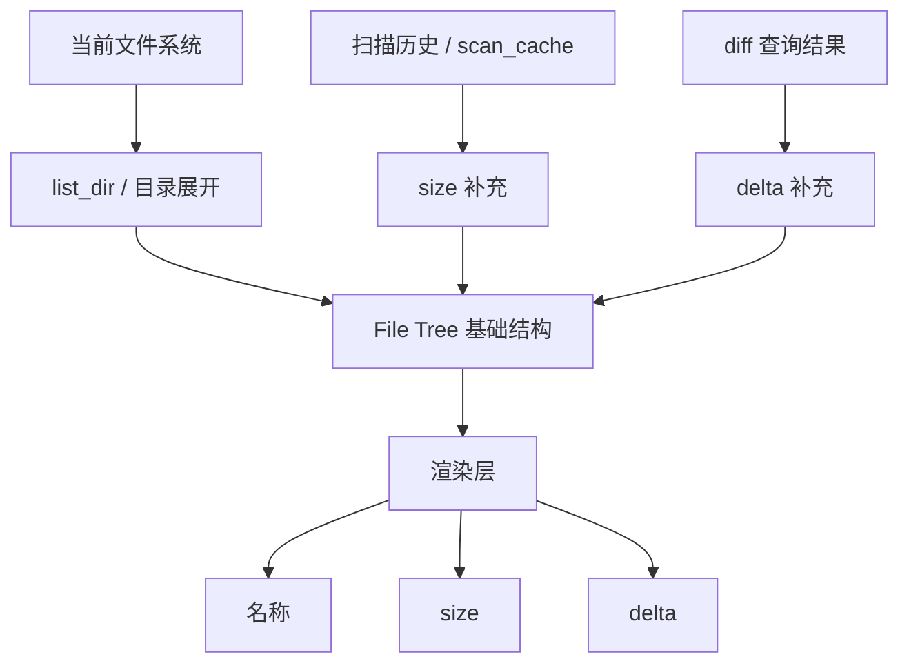

# Argus File Tree Size Design

## 1. Design Goal

Argus 的文件树设计目标是：

1. 文件树始终反映当前文件系统的真实结构。
2. 扫描数据只作为补充信息，用于展示 size、delta 和历史变化。
3. 对于 `node_modules`、`target` 这类大体积缓存/构建目录，扫描结果必须尽量轻量，避免存储膨胀。
4. 文件树中的任意目录都必须可展开，不能因为扫描策略而丢失结构或丢失展开能力。

核心原则可以概括为：

- **结构来自文件系统**
- **大小来自扫描数据**
- **变化量来自 diff 数据**

## 2. Design Context

这份设计是对最近 file tree / filesize 修复链的统一说明，来源于：

- `b47fcc5`: 引入 `has_metadata` 和结构占位节点
- `0b840d0`: 将 diff 从树结构中剥离，改为 overlay
- `17d05dc`: 让树结构始终从 live FS 构建，scan cache 只补 size
- `8067621`: 让展开后的深层目录也能从扫描树恢复 size

这些修复解决了局部 bug，但也暴露出一个更大的问题：**结构、扫描元数据和 diff 元数据的职责边界没有完全收敛**。

## 3. File Tree 的职责

File Tree 是主视图，它负责展示：

- 当前工作目录 `cwd`
- 真实目录层级
- 展开 / 收起 / 上下导航
- 文件和目录的名称
- 节点的 size 和 delta（如果可用）

File Tree 不负责决定一个节点是否存在，也不负责裁剪真实目录结构。  
换句话说，**树怎么长，由文件系统决定；树上显示什么大小，由扫描和 diff 决定**。

## 4. 扫描数据的职责

扫描数据不是树结构本身，而是树节点的补充元数据。它主要用于两件事：

1. 提供目录的递归汇总大小。
2. 为 diff 计算提供历史快照。

扫描数据不会改变文件树的层级关系，也不会决定某个目录能不能展开。

## 5. 大目录的浅扫描策略

对于常见的 cache/build 目录，例如：

- `node_modules`
- `target`
- `dist`
- `build`
- 其他类似的大型中间产物目录

Argus 采用**浅记录、深聚合**的策略。

### 5.1 记录范围

扫描时只记录到这些目录的**直接子节点**这一层：

- 如果直接子节点是文件，记录文件大小。
- 如果直接子节点是目录，只记录该目录下所有文件的递归汇总大小。
- 直接子节点下面更深层的目录和文件，不再继续记录到持久化数据中。

### 5.2 这样做的原因

如果对这类目录做完整递归记录：

- JSON 快照会非常大
- SQLite 路径记录会非常多
- 扫描和加载时间会显著增加
- 用户体感上收益不高，因为这些目录通常只是“知道总量”即可

所以设计上选择只保留“有用的统计信息”，避免把大量中间层结构永久写入存储。

## 6. 目录展开的设计约束

尽管扫描会对某些目录做浅记录，但文件树仍然必须满足两个约束：

1. **所有目录都能展开**
2. **展开后的结构必须来自当前文件系统，而不是扫描缓存的残留结构**

这意味着：

- 扫描数据可以缺失深层元数据
- 但目录节点本身不能因此消失
- 目录展开时应重新从磁盘读取当前目录项

这也是之前“有些目录无法展开”一类 bug 的根源所在。  
正确做法不是阻止展开，而是把“展开能力”和“大小信息是否完整”解耦。

## 7. `...` 的语义

历史上这些节点常被称为 `ignored`，但在当前设计里，`ignored` 这个词容易引起误解。更准确的说法是：

- 这些节点在树结构上是存在的
- 只是它们的深层扫描元数据没有被完整持久化
- 所以在 size 列上用 `...` 表示“这是结构节点，但没有可展示的大小信息”

### 7.1 适用场景

`...` 只用于这类节点：

- 目录树中存在
- 当前可以展开
- 但其递归大小数据没有被记录下来

### 7.2 不适用场景

`...` 不应该用于：

- 普通未扫描目录
- 真实文件
- 已有完整扫描数据的目录

### 7.3 与 `-` 的区别

- `-` 表示：这是一个真实目录，但当前没有扫描汇总 size
- `...` 表示：这是一个结构占位节点，深层大小信息没有被保留

这两个状态必须区分，否则用户会把“没扫过”和“扫过但没保存深层元数据”混为一谈。

## 8. Size 和 Delta 的显示规则

### 8.1 文件

- 文件始终显示真实 size
- 如果存在 diff 数据，则同时显示 delta

### 8.2 普通目录

- 如果有扫描汇总 size，则显示该汇总 size
- 如果没有扫描汇总 size，则显示 `-`
- 如果有 diff 数据，则显示 delta

### 8.3 结构占位节点

- 只显示 `...`
- 不把 `0 B` 误显示成真实大小
- 不把它当成普通未扫描目录

## 9. 当前设计的逻辑顺序

推荐的数据流顺序如下：

## 10. Implementation Constraints

### 10.1 Source of truth

- `list_dir()` 是目录结构的来源
- `scan_cache` 只补 size，不改结构
- `diff_lookup` 只补 delta，不改结构

### 10.2 Avoid semantic guessing

以下做法会再次引入歧义：

1. 用 `size == 0` 判断节点语义。
2. 让扫描缓存决定树的结构。
3. 用同一个标志同时表示“有历史扫描”和“有真实元数据”。
4. 把“能不能展开”和“有没有 size”绑在一起。
5. 在渲染层临时猜测节点类型，而不是由明确状态驱动。

### 10.3 Expansion behavior

- 所有目录都必须保持可展开
- 展开时如果需要，应重新从磁盘读取一级目录项
- 浅扫描目录的深层元数据缺失，不能阻止展开

### 10.4 Rendering contract

- 文件：始终显示真实 size
- 普通目录：有扫描 size 就显示，没有就显示 `-`
- 结构占位节点：显示 `...`
- diff 只影响 delta 列，不影响树结构

## 11. Design Summary

Argus 的文件树不是“扫描结果树”，而是“真实文件系统树 + 元数据覆盖层”。

因此：

- 树结构必须永远可见、可展开
- 扫描数据只负责补充 size
- diff 数据只负责补充 delta
- 大目录的深层结构可以不持久化，但不能影响树的可导航性
- `...` 是“结构存在但深层元数据缺失”的明确标记，不是普通 size 缺失

这套设计的目的，是在控制存储规模的同时，避免再次出现“节点不可展开”“size 语义混乱”“扫描结果反过来改树结构”这类问题。
