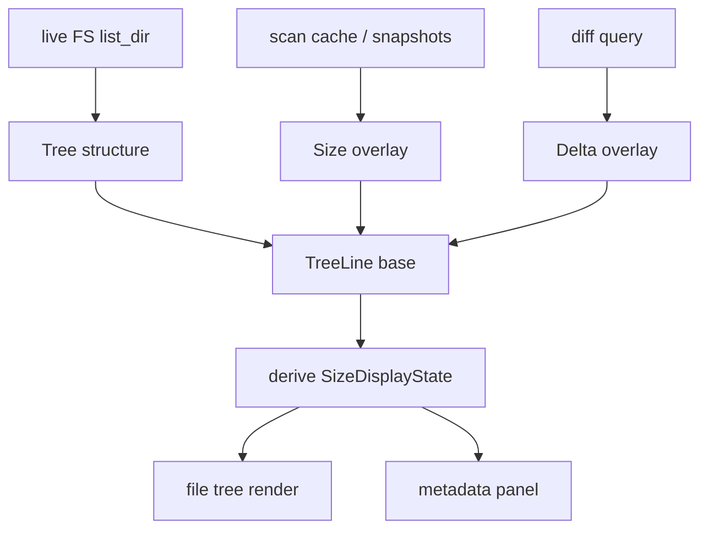

# File Tree Size Model Proposal

## Goal

Stabilize file tree size rendering by making the data model explicit instead of inferring meaning from `size == 0` or from multiple overlapping flags.

The current implementation mixes three concerns:

- live filesystem structure
- scan-derived recursive sizes
- diff overlay data

The proposal below keeps those concerns separate and defines a single rendering contract.

## Problem Statement

Today the same node can be interpreted in several ways:

- as a live FS entry
- as a scanned snapshot node
- as a structural placeholder
- as a diff-overlay target

That creates repeated bugs because a fix in one layer can still be invalid in another layer.

## Design Principles

1. Tree structure comes from live FS only.
2. Scan history only contributes size metadata.
3. Diff data only contributes delta metadata.
4. Rendering must not guess meaning from `size == 0`.
5. Placeholder nodes must be explicit, not encoded as a special size value.

## Proposed Model

### 1. Separate node identity from node data

Keep the current `FileNode` for filesystem facts, but treat `size` as a raw FS or snapshot value only.

Introduce a rendering overlay record:

```rust
struct NodeOverlay {
    has_scan_size: bool,
    has_diff_delta: bool,
    is_placeholder: bool,
    scanned_size: Option<u64>,
    delta: Option<i64>,
}
```

The tree node remains the source of structure. The overlay decides what can be shown.

### 2. Make display state explicit

Replace the current implicit rendering rules with a small state enum:

```rust
enum SizeDisplayState {
    RealSize(u64),
    ScannedSize(u64),
    UnscannedDir,
    Placeholder,
}
```

This removes the need to infer from:

- `has_metadata`
- `has_scan_data`
- `size == 0`

### 3. Define a single render contract

Recommended rule set:

- File node:
  - always show real file size from live FS or scanned snapshot
- Directory node:
  - if scan size exists, show recursive scanned size
  - else show `-`
- Placeholder node:
  - always show `...`
- Diff delta:
  - render only if diff overlay exists for that path

## Proposed Data Flow



## State Definitions

### Base tree state

- `LiveFs`
  - node comes from directory listing
  - structure is authoritative
- `ScannedTree`
  - node exists in scan cache
  - only size metadata is authoritative

### Overlay state

- `None`
  - no scan data, no diff data
- `ScanOnly`
  - size available, no delta
- `DiffOnly`
  - delta available, size from base tree
- `ScanAndDiff`
  - both overlays available

## Recommended API Shape

### App-level tree line

```rust
pub struct TreeLine {
    pub depth: usize,
    pub node: TreeNode,
    pub expanded: bool,
    pub size_state: SizeDisplayState,
    pub delta: Option<i64>,
}
```

This is better than carrying separate booleans that can drift apart.

### Overlay lookup

Use two lookups:

- `scan_lookup: HashMap<PathBuf, ScanInfo>`
- `diff_lookup: HashMap<Vec<String>, DiffInfo>`

Where `ScanInfo` stores only scan-derived size facts for a node path:

```rust
struct ScanInfo {
    size: u64,
    is_placeholder: bool,
}
```

## Migration Path

### Phase 1

- Keep current `FileNode` structure.
- Stop inferring display state from `size == 0`.
- Make placeholder rendering depend only on an explicit placeholder flag.
- Make directory `-` rendering depend only on absence of scan size.

### Phase 2

- Replace `has_metadata` and `has_scan_data` in render paths with `SizeDisplayState`.
- Move overlay derivation into one helper.
- Keep tree flattening dumb: it should only attach overlays, not decide semantics.

### Phase 3

- Normalize scan cache enrichment so it produces a single scan overlay source per node path.
- Eliminate duplicate fallback rules in `build_current_tree` and `expand_node`.

## Rule Matrix

| Node kind | Scan size | Placeholder | Delta | Display |
|---|---:|---:|---:|---|
| File | yes | no | optional | `123 KB` |
| File | no | no | optional | `123 KB` from FS |
| Dir | yes | no | optional | recursive size |
| Dir | no | no | optional | `-` |
| Any | any | yes | any | `...` |

## What This Fixes

1. No more `size == 0` heuristics for “should I reload or should I show dash”.
2. No more ambiguity between structural placeholders and unscanned directories.
3. No more split rendering logic between tree and metadata panel.
4. Easier to test because display state becomes a pure function of overlays.

## Open Choice

There are two reasonable implementation styles:

1. Keep `FileNode` unchanged and add a separate overlay layer.
2. Expand `FileNode` with an explicit `node_state` or `display_state` field.

Recommendation: start with option 1. It is lower risk and preserves existing core model compatibility.

## Success Criteria

- `...` only appears for explicit structural placeholders.
- `-` only appears for directories without scan size.
- Files always show real size.
- No render code branches on `size == 0` to determine semantics.
- Tree structure remains live FS even when scan data or diff data is present.
