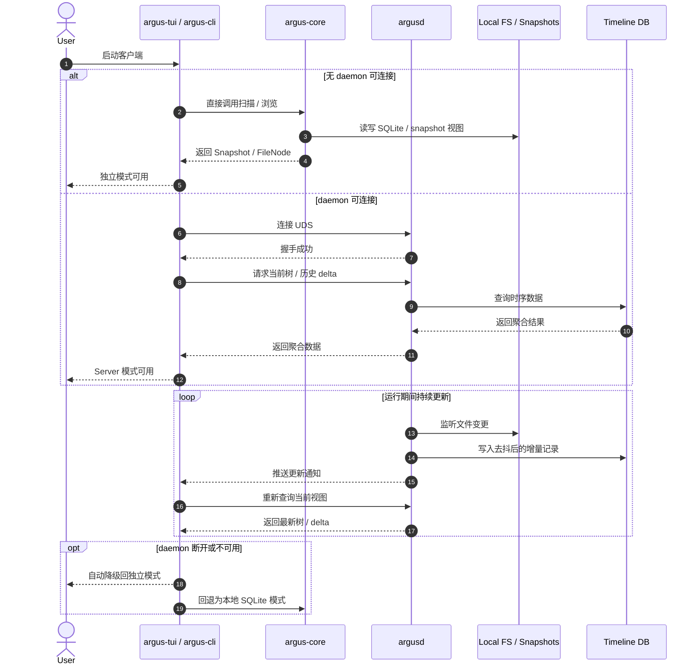

# 系统架构设计

## 1. 整体三层架构

项目采用**核心库 + 多端适配 + 守护进程**的解耦架构：

```
+---------------------------------------------------------------+
|                    表现层 (Clients)                            |
|  +-------------------+  +------------------+  +-------------+  |
|  |    argus-cli      |  |    argus-tui     |  |  argus-gui  |  |
|  | (集成测试/自动化)  |  | (Vim-like TUI)   |  | (Slint/Tauri)| |
|  +---------+---------+  +--------+---------+  +------+------+  |
+-----------|---------------------|-------------------|---------+
            |                     |                   |
            +----------+----------+-------------------+
                       | (IPC: UDS / Named Pipes)
                       v
+---------------------------------------------------------------+
|                      服务层 (Service Layer)                    |
|  +---------------------------------------------------------+  |
|  |                      argusd                             |  |
|  |  后台守护进程: 事件循环 / FSEvents / Inotify / 去抖引擎   |  |
|  +----------------------------+----------------------------+  |
+-------------------------------|-------------------------------+
                               | (库调用 / 链接)
                               v
+---------------------------------------------------------------+
|                      核心引擎层 (Core Engine)                  |
|  +---------------------------------------------------------+  |
|  |                    argus-core                            |  |
|  |  - FileTree 算法 (核心数据结构)                           |  |
|  |  - SQLite 扫描记录持久化                                  |  |
|  |  - 快照序列化 (JSON)                                      |  |
|  |  - 多线程并行扫描器 (基于 ignore 库)                      |  |
|  +---------------------------------------------------------+  |
+---------------------------------------------------------------+
```

## 2. Cargo Workspace 组织

项目以 Monorepo 管理，目录结构如下：

```
argus/
├── Cargo.toml              # Workspace 根配置
├── argus-core/             # 纯逻辑库 (lib)
│   ├── Cargo.toml
│   └── src/
│       ├── lib.rs
│       ├── model.rs        # 核心数据结构
│       ├── scanner.rs      # 文件扫描引擎
│       └── db.rs           # SQLite 存储层
├── argusd/                 # 守护进程 (bin)
│   ├── Cargo.toml
│   └── src/
│       └── main.rs
├── argus-cli/              # 命令行客户端 (bin)
│   ├── Cargo.toml
│   └── src/
│       └── main.rs
├── argus-tui/              # TUI 客户端 (bin)
│   ├── Cargo.toml
│   └── src/
│       └── main.rs
└── argus-gui/              # GUI 客户端 (bin - 后期)
    ├── Cargo.toml
    └── src/
        └── main.rs
```

## 3. 客户端通信模式

### 3.1 双模驱动

| 模式 | 适用场景 | 实现原理 |
|------|---------|---------|
| **独立模式 (Standalone)** | CLI 自动化测试、一次性扫描；TUI 默认启动模式 | Clients 直接调用 `argus-core`，扫描历史写入 SQLite，客户端在内存中 materialize 为 `scan_cache` |
| **服务模式 (Client-Server)** | TUI/GUI 需要实时增量监控 | 通过 Unix Domain Socket (UDS) 与 `argusd` 通信。Windows 使用 Named Pipes |

**独立模式下的文件树**：TUI 始终以用户当前工作目录 (cwd) 为根展示可自由游走的文件树。
所有行为均通过调用 `argus-core` 实现，不依赖外部服务。

**两层数据驱动文件树**：

| 层 | 来源 | 始终可用 |
|----|------|---------|
| **FS 层** | `list_dir()` 惰性读取磁盘目录内容 | 是 |
| **Scan 层** | `scan_cache` 缓存 SQLite materialize 出来的最新扫描结果 | 仅扫描后 |

- 文件始终展示真实大小（单次 `stat` 低成本）
- 目录有扫描汇总大小时展示该值，否则展示 `"-"`
- `...` 仅用于结构占位节点，表示深层元数据未持久化
- 详见 `docs/plans/standalone-fs-navigation-refactor.md`

#### 模式切换时序



### 3.2 IPC 通信协议

Phase 3 守护进程通信使用基于 `serde` 的 RPC 消息体；传输编码优先采用 `bincode`，与 Phase 1 快照 JSON 格式相互独立：

```rust
// FUTURE: Phase 3 daemon IPC request types
enum ArgusRequest {
    GetDelta { path: PathBuf, from: u64, to: u64 },
    TriggerDelete { path: PathBuf, secure: bool },
}
```

## 4. 技术栈选型

| 组件 | 技术 | 选型理由 |
|------|------|---------|
| 核心扫描 | `ignore` (ripgrep 同款) | 多线程高性能，自动尊重 .gitignore |
| 文件监控 | `notify` | 跨平台文件变动通知 (inotify/FSEvents) |
| 快照序列化 | `serde` + `serde_json` | Phase 1 快照格式，便于 Debug |
| IPC 编码 (Phase 3) | `serde` + `bincode` | 守护进程 RPC 传输编码，低开销；不影响快照 JSON 格式 |
| 日志 | `tracing` + `tracing-subscriber` | 结构化 JSON + 终端彩色，支持 span 链路追踪 |
| TUI 界面 | `ratatui` + `crossterm` | tui-rs 正统续作，事件驱动组件化 |
| 异步运行时 | `tokio` | 全异步操作，保证 TUI 流畅 |
| AI 客户端 | `async-openai` | 兼容 OpenAI 格式的本地/云端模型 |
| 守护进程通信 | Unix Domain Socket | 低延迟、安全、跨平台 |
| 错误类型 | `thiserror` | Rust 标准 error 派生宏 |
| 快照 hash | `sha2` | 生成 root_path_hash 用于快照文件命名（前 8 字符） |
| 数据持久化 (后期) | SQLite / sled | 轻量嵌入式数据库 |
